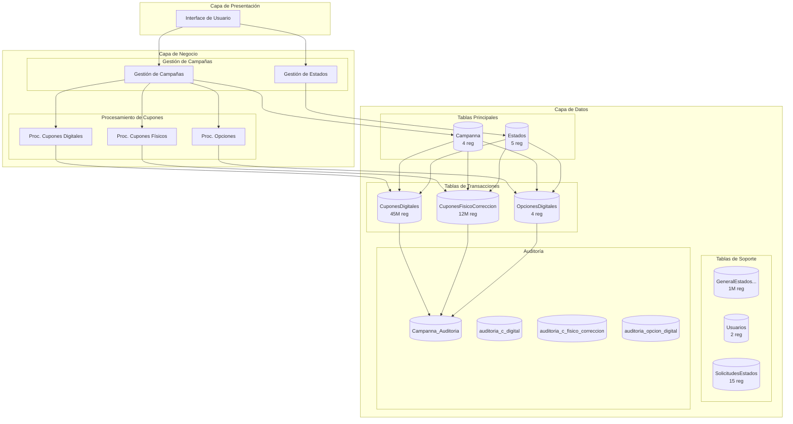
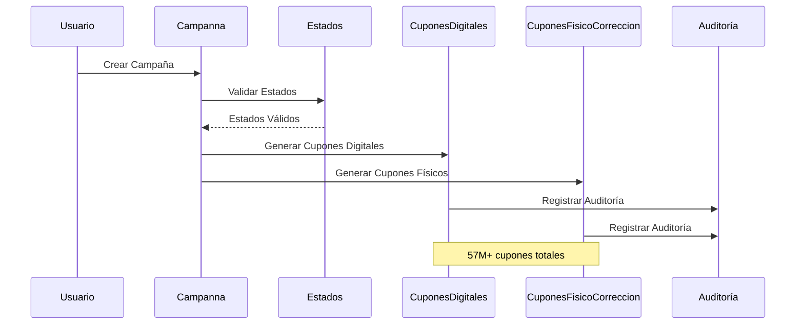
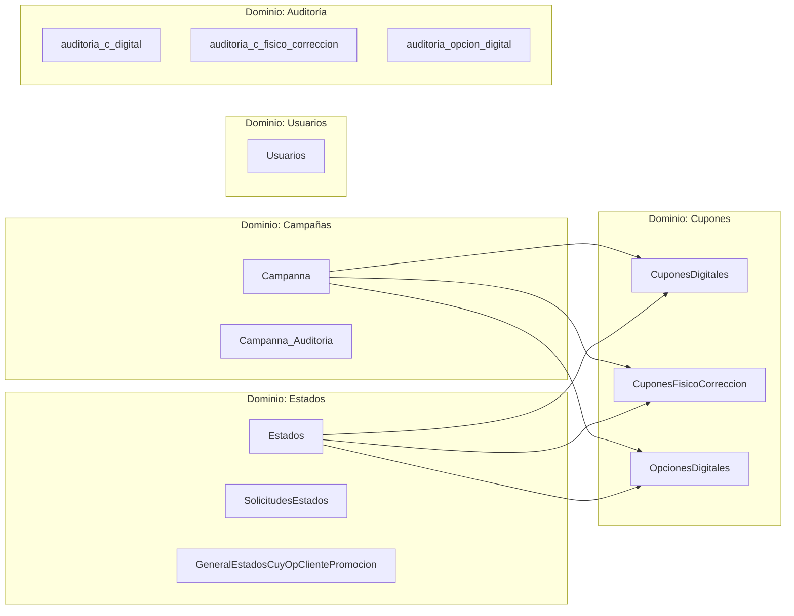
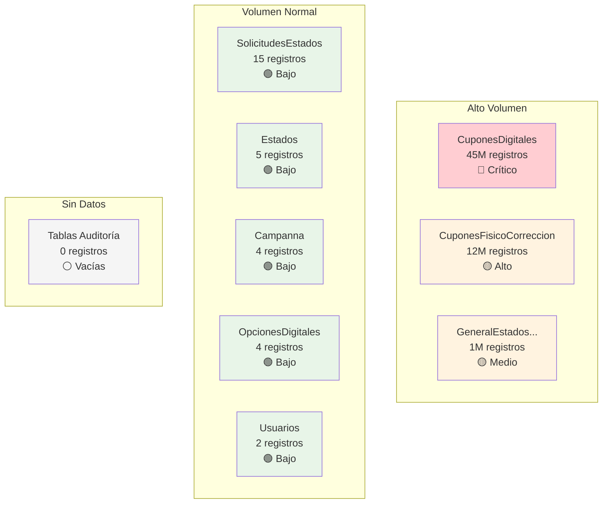

# Arquitectura del Sistema - Diagramas Mermaid

## Arquitectura de Capas

```mermaid
graph TB
    subgraph "Capa de Presentación"
        UI[Interface de Usuario]
    end
    
    subgraph "Capa de Negocio"
        subgraph "Gestión de Campañas"
            GC[Gestión de Campañas]
            GE[Gestión de Estados]
        end
        
        subgraph "Procesamiento de Cupones"
            PCD[Proc. Cupones Digitales]
            PCF[Proc. Cupones Físicos]
            PO[Proc. Opciones]
        end
    end
    
    subgraph "Capa de Datos"
        subgraph "Tablas Principales"
            T1[(Campanna<br/>4 reg)]
            T2[(Estados<br/>5 reg)]
        end
        
        subgraph "Tablas de Transacciones"
            T3[(CuponesDigitales<br/>45M reg)]
            T4[(CuponesFisicoCorreccion<br/>12M reg)]
            T5[(OpcionesDigitales<br/>4 reg)]
        end
        
        subgraph "Tablas de Soporte"
            T6[(GeneralEstados...<br/>1M reg)]
            T7[(Usuarios<br/>2 reg)]
            T8[(SolicitudesEstados<br/>15 reg)]
        end
        
        subgraph "Auditoría"
            A1[(Campanna_Auditoria)]
            A2[(auditoria_c_digital)]
            A3[(auditoria_c_fisico_correccion)]
            A4[(auditoria_opcion_digital)]
        end
    end
    
    UI --> GC
    UI --> GE
    GC --> PCD
    GC --> PCF
    GC --> PO
    
    GC --> T1
    GE --> T2
    PCD --> T3
    PCF --> T4
    PO --> T5
    
    T1 --> T3
    T1 --> T4
    T1 --> T5
    T2 --> T3
    T2 --> T4
    T2 --> T5
    
    T3 --> A1
    T4 --> A1
    T5 --> A1
```

## Flujo de Datos Principal

```mermaid
sequenceDiagram
    participant U as Usuario
    participant C as Campanna
    participant E as Estados
    participant CD as CuponesDigitales
    participant CF as CuponesFisicoCorreccion
    participant A as Auditoría
    
    U->>C: Crear Campaña
    C->>E: Validar Estados
    E-->>C: Estados Válidos
    
    C->>CD: Generar Cupones Digitales
    C->>CF: Generar Cupones Físicos
    
    CD->>A: Registrar Auditoría
    CF->>A: Registrar Auditoría
    
    Note over CD,CF: 57M+ cupones totales
```

## Modelo de Datos por Dominio

```mermaid
graph LR
    subgraph "Dominio: Campañas"
        DC1[Campanna]
        DC2[Campanna_Auditoria]
    end
    
    subgraph "Dominio: Cupones"
        DD1[CuponesDigitales]
        DD2[CuponesFisicoCorreccion]
        DD3[OpcionesDigitales]
    end
    
    subgraph "Dominio: Estados"
        DE1[Estados]
        DE2[SolicitudesEstados]
        DE3[GeneralEstadosCuyOpClientePromocion]
    end
    
    subgraph "Dominio: Usuarios"
        DU1[Usuarios]
    end
    
    subgraph "Dominio: Auditoría"
        DA1[auditoria_c_digital]
        DA2[auditoria_c_fisico_correccion]
        DA3[auditoria_opcion_digital]
    end
    
    DC1 --> DD1
    DC1 --> DD2
    DC1 --> DD3
    DE1 --> DD1
    DE1 --> DD2
    DE1 --> DD3
```

## Diagrama de Rendimiento

```mermaid
graph TD
    subgraph "Alto Volumen"
        A1[CuponesDigitales<br/>45M registros<br/>🔴 Crítico]
        A2[CuponesFisicoCorreccion<br/>12M registros<br/>🟡 Alto]
        A3[GeneralEstados...<br/>1M registros<br/>🟡 Medio]
    end
    
    subgraph "Volumen Normal"
        B1[SolicitudesEstados<br/>15 registros<br/>🟢 Bajo]
        B2[Estados<br/>5 registros<br/>🟢 Bajo]
        B3[Campanna<br/>4 registros<br/>🟢 Bajo]
        B4[OpcionesDigitales<br/>4 registros<br/>🟢 Bajo]
        B5[Usuarios<br/>2 registros<br/>🟢 Bajo]
    end
    
    subgraph "Sin Datos"
        C1[Tablas Auditoría<br/>0 registros<br/>⚪ Vacías]
    end
    
    style A1 fill:#ffcdd2
    style A2 fill:#fff3e0
    style A3 fill:#fff3e0
    style B1 fill:#e8f5e8
    style B2 fill:#e8f5e8
    style B3 fill:#e8f5e8
    style B4 fill:#e8f5e8
    style B5 fill:#e8f5e8
    style C1 fill:#f5f5f5
```
