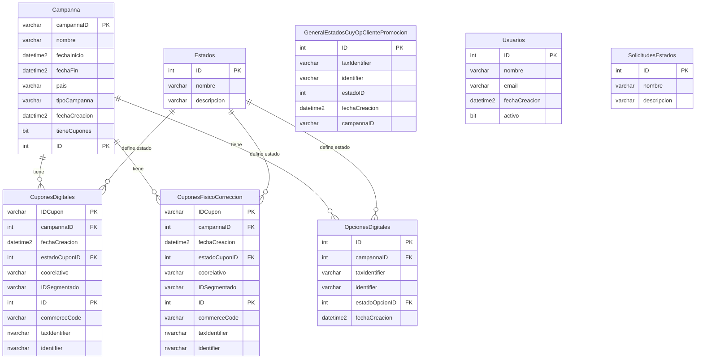
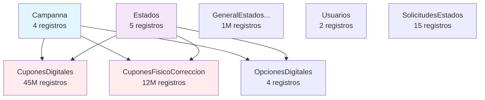
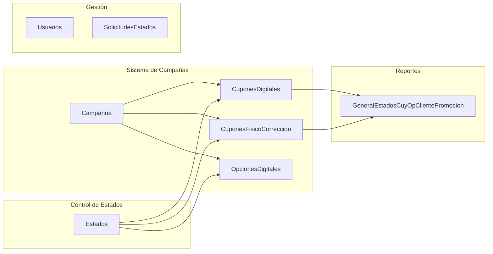

# EDR - Diagramas Mermaid

## Diagrama de Relaciones Completo

```mermaid
erDiagram
    Campanna {
        varchar campannaID PK
        varchar nombre
        datetime2 fechaInicio
        datetime2 fechaFin
        varchar pais
        varchar tipoCampanna
        datetime2 fechaCreacion
        bit tieneCupones
        int ID PK
    }
    
    Estados {
        int ID PK
        varchar nombre
        varchar descripcion
    }
    
    CuponesDigitales {
        varchar IDCupon PK
        int campannaID FK
        datetime2 fechaCreacion
        int estadoCuponID FK
        varchar coorelativo
        varchar IDSegmentado
        int ID PK
        varchar commerceCode
        nvarchar taxIdentifier
        nvarchar identifier
    }
    
    CuponesFisicoCorreccion {
        varchar IDCupon PK
        int campannaID FK
        datetime2 fechaCreacion
        int estadoCuponID FK
        varchar coorelativo
        varchar IDSegmentado
        int ID PK
        varchar commerceCode
        nvarchar taxIdentifier
        nvarchar identifier
    }
    
    OpcionesDigitales {
        int ID PK
        int campannaID FK
        varchar taxIdentifier
        varchar identifier
        int estadoOpcionID FK
        datetime2 fechaCreacion
    }
    
    GeneralEstadosCuyOpClientePromocion {
        int ID PK
        varchar taxIdentifier
        varchar identifier
        int estadoID
        datetime2 fechaCreacion
        varchar campannaID
    }
    
    Usuarios {
        int ID PK
        varchar nombre
        varchar email
        datetime2 fechaCreacion
        bit activo
    }
    
    SolicitudesEstados {
        int ID PK
        varchar nombre
        varchar descripcion
    }

    %% Relaciones
    Campanna ||--o{ CuponesDigitales : "tiene"
    Campanna ||--o{ CuponesFisicoCorreccion : "tiene"
    Campanna ||--o{ OpcionesDigitales : "tiene"
    Estados ||--o{ CuponesDigitales : "define estado"
    Estados ||--o{ CuponesFisicoCorreccion : "define estado"
    Estados ||--o{ OpcionesDigitales : "define estado"
```

## Diagrama Simplificado - Vista de Negocio

```mermaid
graph TD
    A[Campanna<br/>4 registros] --> B[CuponesDigitales<br/>45M registros]
    A --> C[CuponesFisicoCorreccion<br/>12M registros]
    A --> D[OpcionesDigitales<br/>4 registros]
    
    E[Estados<br/>5 registros] --> B
    E --> C
    E --> D
    
    F[GeneralEstados...<br/>1M registros]
    G[Usuarios<br/>2 registros]
    H[SolicitudesEstados<br/>15 registros]
    
    style A fill:#e1f5fe
    style B fill:#ffebee
    style C fill:#ffebee
    style E fill:#f3e5f5
```

## Diagrama de Flujo de Datos

```mermaid
flowchart LR
    subgraph "Sistema de Campañas"
        A[Campanna] --> B[CuponesDigitales]
        A --> C[CuponesFisicoCorreccion]
        A --> D[OpcionesDigitales]
    end
    
    subgraph "Control de Estados"
        E[Estados] --> B
        E --> C
        E --> D
    end
    
    subgraph "Gestión"
        F[Usuarios]
        G[SolicitudesEstados]
    end
    
    subgraph "Reportes"
        H[GeneralEstadosCuyOpClientePromocion]
    end
    
    B --> H
    C --> H
```
